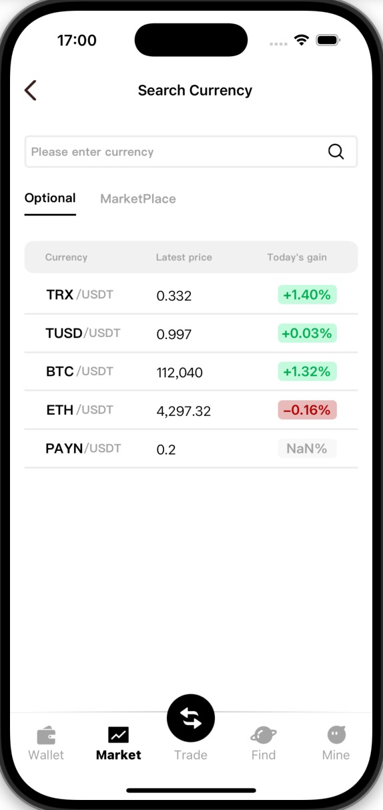

[![LinkedIn][linkedin-shield]][linkedin-url]

 

  

  

  
    <h1 align="center">Dom Wallet</h1>
  

  

    A crypto wallet built with React Native
     
    
  

## Introduction

BMO Wallet is a multi-chain cryptocurrency wallet built with React Native. This robust mobile application offers a comprehensive suite of features for managing digital assets across multiple blockchains, with a current focus on Ethereum and Solana networks.

## Tech Stack

This project leverages a modern tech stack for building and managing a cross-platform cryptocurrency wallet application:

* [![typescript][typescript]][ts-url] - A strongly typed programming language that builds on JavaScript, giving you better tooling at any scale.

* [![react-native][react-native]][rn-url] - A framework for building native apps using React, enabling native mobile development with JavaScript.

* [![expo][expo]][expo-url] - An open-source platform for making universal native apps with React that run on Android, iOS, and the web.

* [![styled-components][styled-components]][sc-url] - A library that utilizes tagged template literals to style your components at a component level using CSS.

* **Ethers.js** - A complete Ethereum wallet implementation and utilities in JavaScript (and TypeScript), used for blockchain interactions.

* **Tronweb.js** - Tron network JavaScript API library, enabling interaction with the Tron Blockchain.

* **Alchemy SDK** - A powerful toolkit that simplifies the process of making requests to the Blockchain, enhancing the app’s capability to interact with Ethereum and Solana.

[ <a href="#introduction">↑ Back to top ↑</a> ]

---

## Features

### Wallet Management
- **Create Wallet**: Generate new wallets seamlessly.
- **Import Wallets**: Import existing wallets using mnemonic phrases.
- **Manage Multiple Wallets**: Create and manage multiple wallets using the same mnemonic phrase.

|                               Login the wallet                               |                             Importing a wallet                             |                               Create a wallet                                |
|:----------------------------------------------------------------------------:|:--------------------------------------------------------------------------:|:----------------------------------------------------------------------------:|
|  |  |  |

### Wallet Balance and Transactions
- **Net Worth**: View the total net worth across all wallets.
- **Balance Viewing**: Check the balance of Ethereum and Tron wallets.
- **Transaction Management**:
    - Send and receive Ethereum and Tron transactions.

|                          Viewing wallet assets                          |                                Swap Token                                |                            Sending Token                             |
|:-----------------------------------------------------------------------:|:------------------------------------------------------------------------:|:--------------------------------------------------------------------:|
|  |  |  |

### Accessibility Features
- **Shared Address**: Easily share wallet addresses and received Token.
- **Market Data**: Get real-time market data for Ethereum and Tron.

|                                 Sharing Address                                 | Market Data | 
|:-------------------------------------------------------------------------------:|:---:|
|  |  

[linkedin-shield]: https://img.shields.io/badge/-LinkedIn-black.svg?style=for-the-badge&logo=linkedin&colorB=555
[linkedin-url]: https://www.linkedin.com/in/vinnyhoward/

[typescript]: https://img.shields.io/badge/typescript-%23007ACC.svg?style=for-the-badge&logo=typescript&logoColor=white
[ts-url]: https://www.typescriptlang.org/

[react-native]: https://img.shields.io/badge/react_native-%2320232a.svg?style=for-the-badge&logo=react&logoColor=%2361DAFB
[rn-url]: https://reactnative.dev/

[expo]: https://img.shields.io/badge/expo-1C1E24?style=for-the-badge&logo=expo&logoColor=#D04A37
[expo-url]: https://docs.expo.dev/

[styled-components]: https://img.shields.io/badge/styled--components-DB7093?style=for-the-badge&logo=styled-components&logoColor=white
[sc-url]: https://styled-components.com/
